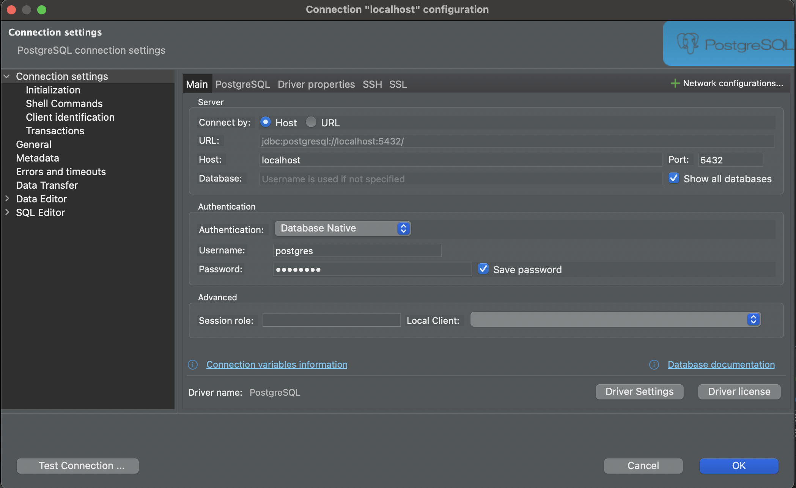

# Deploy on your computer

Please follow instructions. If you encounter any issues please don't hesitate to contact Sobir.

## Content

- [Run Postgres Container](#run-postgres-container)
- [Connect DBeaver to database](#connect-dbeaver-to-database)
- [Install Node.js](#install-node)
- [Create environment files](#create-environment-files)
- [Install dependencies](#install-dependencies)
- [Sync Database](#sync-database)
- [Run application](#run-application)
- [back to interview instruction](../README.md)

## Run Postgres Container

[Content](#content)

Please make sure you have Docker Desktop installed. Installation instructions [here](https://www.docker.com/)
Please run command on your terminal:

```bash
docker compose up -d
```

This will deploy Postgres container base on instructions in `docker-compose.yml` file in root directory of this repository.
please open Docker Desktop and verify you have postgres container running.

## Connect DBeaver to database

[Content](#content)

Please have DBeaver Community edition installed. Installation instructions [here](https://dbeaver.io/). Please connect to your postgres database as shown in this screenshot:



Password will be `postgres`.

## Install Node

[Content](#content)

If you don't have Node js installed on your computer please follow installation instructions [here](https://nodejs.org/en).

## Create environment files

[Content](#content)

In repository root directory please create `.env` file and add this environment variables:

```Configuration
POSTGRES_USER=postgres
POSTGRES_PASSWORD=postgres
POSTGRES_DB=census_app
POSTGRES_HOST=localhost
POSTGRES_PORT=5432

DATABASE_URL=`postgresql://${POSTGRES_USER}:${POSTGRES_PASSWORD}@${POSTGRES_HOST}:${POSTGRES_PORT}/${POSTGRES_DB}?schema=public`
```

In repository root directory please create second `.env.local` file and add this environment variables:

```Configuration
AUTH_SECRET=1hWCheVza3jTjPXzK1RpkKA08crxLKKCBXLPhX9Ts2mA
```

## Install dependencies

[Content](#content)

If you aren't done so yet please run command in terminal:

```bash
npm install
```

## Sync Database

[Content](#content)

In order for Application to save and read from postgres database that you've deployed we need to create all tables needed. please run command on terminal:

```bash
npx prisma db push
```

## Run application

[Content](#content)

now that we have set up all dependencies we can run our application. Before you run it please make sure your localhost port 3000 is not occupied by any other apps. If you don't know what it is then most likely post 3000 is available. please run command on terminal:

```bash
npm run dev
```

After 30 sec please open url `localhost:3000/` on your browser. This should open `About` page. Terminal will be attached to running application. Please use another instance of terminal for any other needs. Once you done working for today to kill running application please click `CMD` + `C` for MAC or `CTRL` + `C` for Windows or Linux on this terminal.

[back to interview instruction](../README.md)
